# Rotten Potatoes

Infra desenvolvida no evento Iniciativa Kubernetes

**Crie sua conta no DockerHub, depois pegue seu username e mude em todos os arquivos do app. Por exemplo de `felippedeiro/rotten-potatoes` para `<seu-username>/rotten-potatoes`. Os arquivos que terão que ser modificado são: 'k8s/deployment.yaml', 'github/workflows/main.yml'**

## Com Docker Compose

1. `cd rotten-potatoes/src`
1. `docker compose up --build` (`ctrl+c` para parar e sair do container, `docker-compose down` para remover os containers)
1. quando terminar de iniciar os containers,abra o navegador cole a url `localhost:8080`

## Com Kubernetes

### Subindo imagem pro Docker Hub

1. `docker login`
1. `docker image build -t felippedeiro/rotten-potatoes:v1 ./src`
1. `docker push felippedeiro/rotten-potatoes:v1`
1. `docker tag felippedeiro/rotten-potatoes:v1 felippedeiro/rotten-potatoes:latest`
1. `docker push felippedeiro/rotten-potatoes:latest`

### Iniciando Kubernetes

1. `cd rotten-potatoes/`
1. `kind create cluster --name meucluster --config cluster.yaml`
1. `kubectl apply -f ./k8s/deployment.yaml` (`kubectl delete -f ./k8s/deployment.yaml` para remover tudo que foi feito)
1. `docker container ls`, copie o container-id do container worker
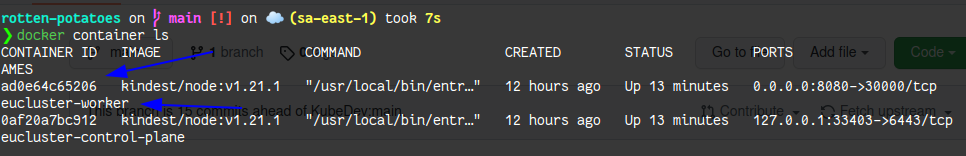
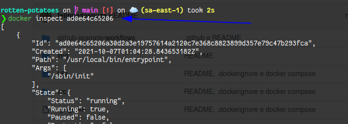
1. `docker inspect ad0e64c65206`, copie IPAddress
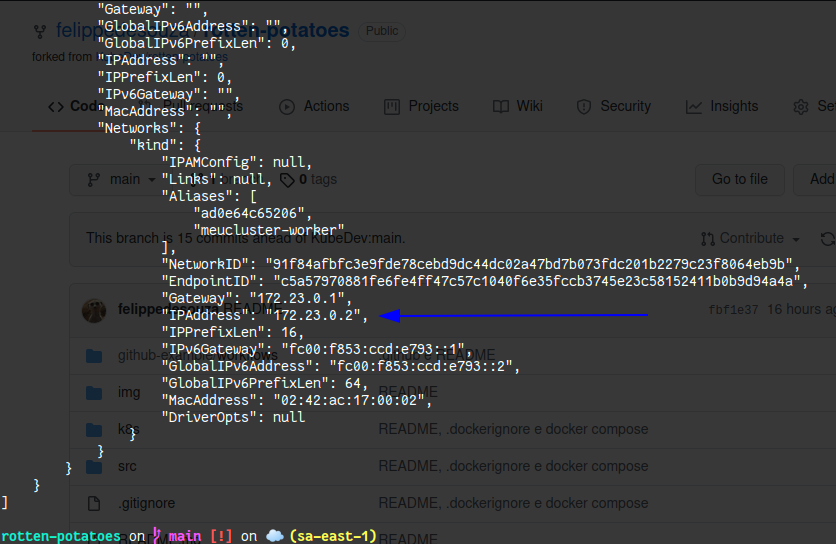
1. `kubectl get services`, copie a porta do service web
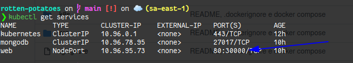
1. abra o navegador cole a url `172.23.0.2:30000`

## Com CI/CD e Digital Ocean

1. faça um fork do repositório
1. crie um cluster na digital ocean (não esqueça de remover quando não for usar)
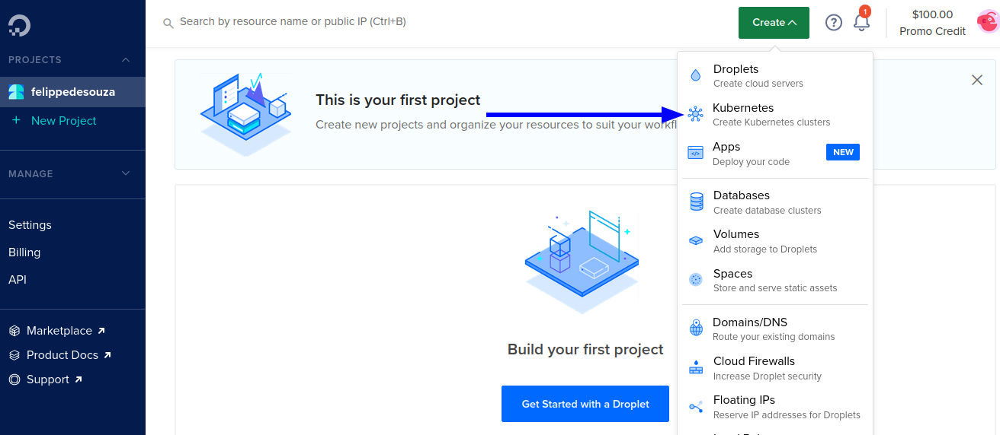
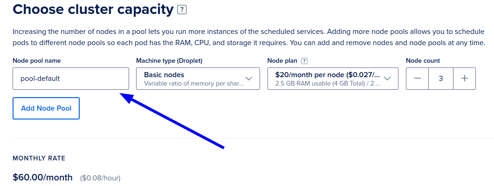
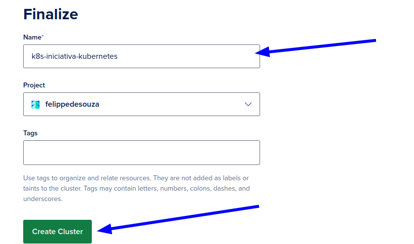
1. espere o cluster ser criado e faça download do config file
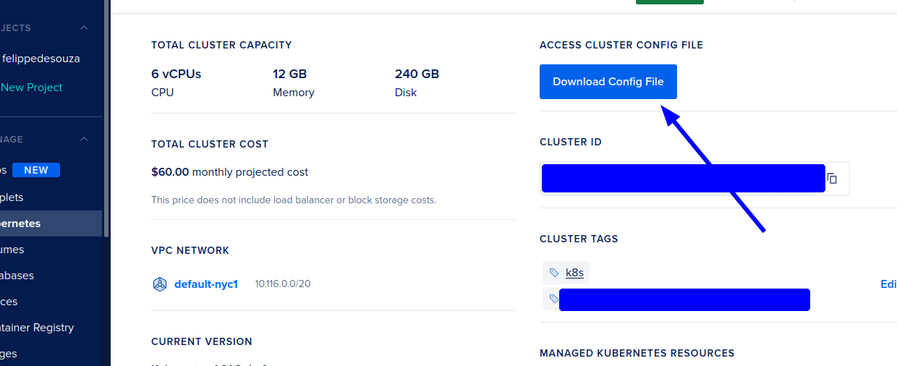
1. copie o config file e cole na pasta '~/.kube': `cp k8s-iniciativa-kubernetes-kubeconfig.yaml ~/.kube/config`
1. mude o type do Service web de 'NodePort' para 'LoadBalancer' o arquivo 'k8s/deployment.yaml'
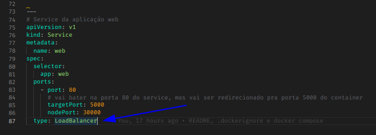
1. crie um secrets no github com chave K8S_CONFIG e no valor cole o conteudo do `k8s-iniciativa-kubernetes-kubeconfig.yaml` da Digital Ocean
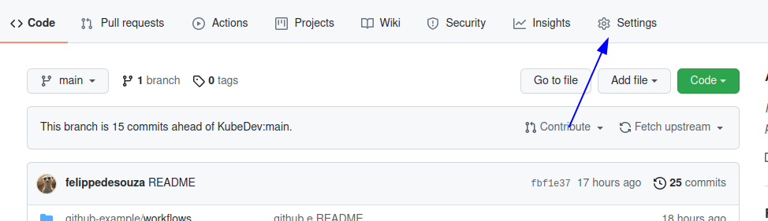
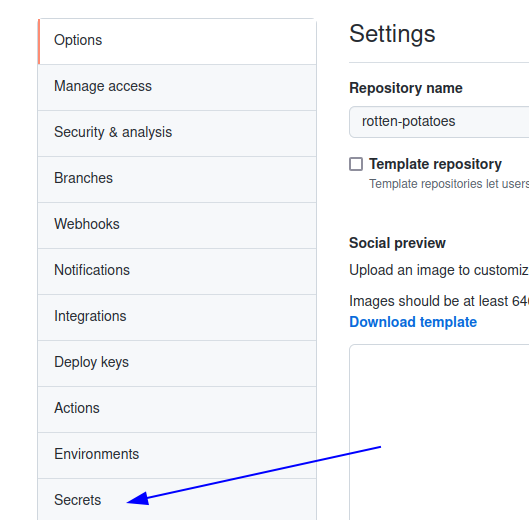
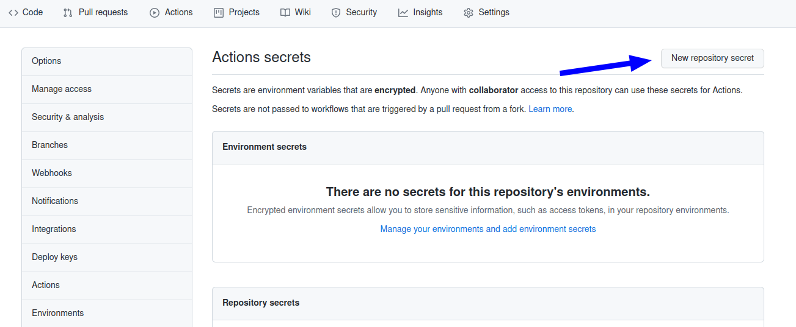
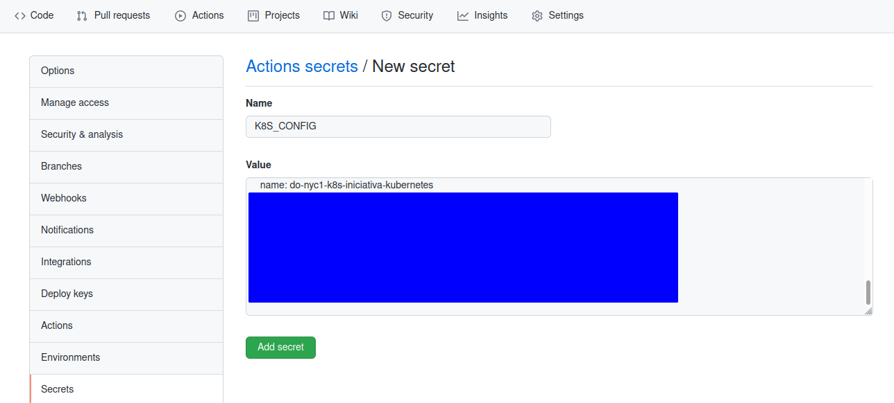
1. crie os secrets pro user e senha (DOCKERHUB_PWD) da sua conta no DockerHub para a pipeline conseguir fazer upload da sua imagem pra lá
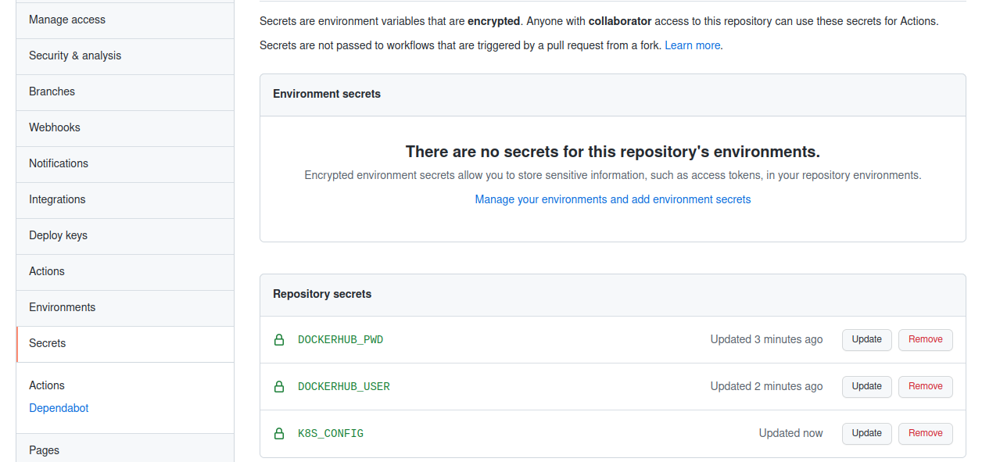
1. `mv github-example .github`: para o GitHub ler o pipeline e executar
1. `git push origin main`
1. vá ate o Actions do GitHub e espere a pipeline terminar
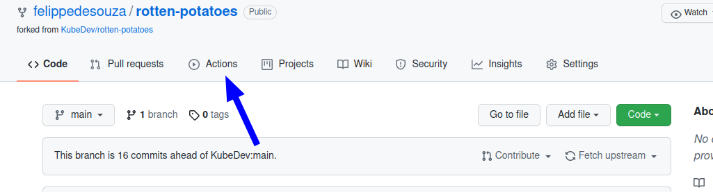
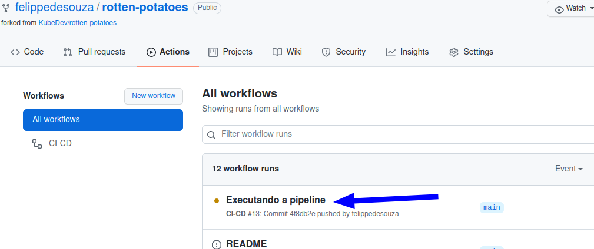
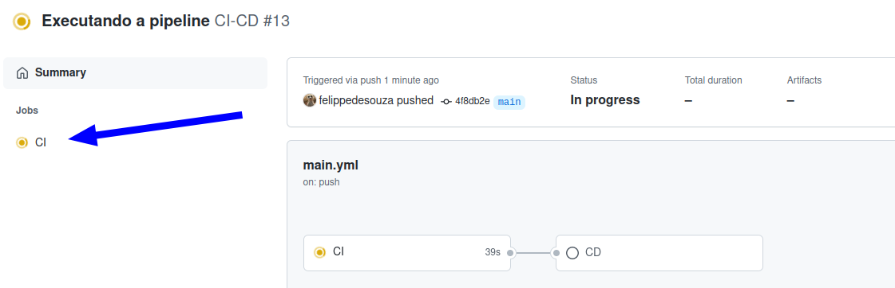
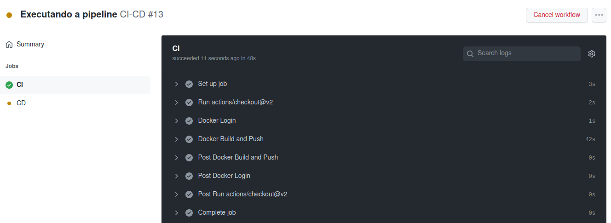
1. quando terminar, execute o código `watch 'kubectl get all'` e copie o ip publico
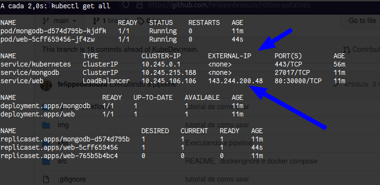
1. cole na url do navegador `143.244.200.48`
